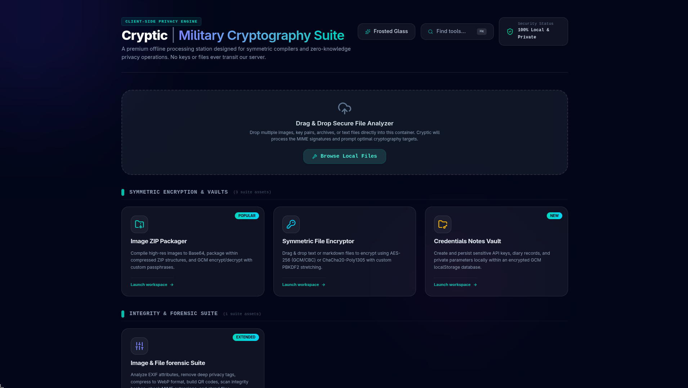
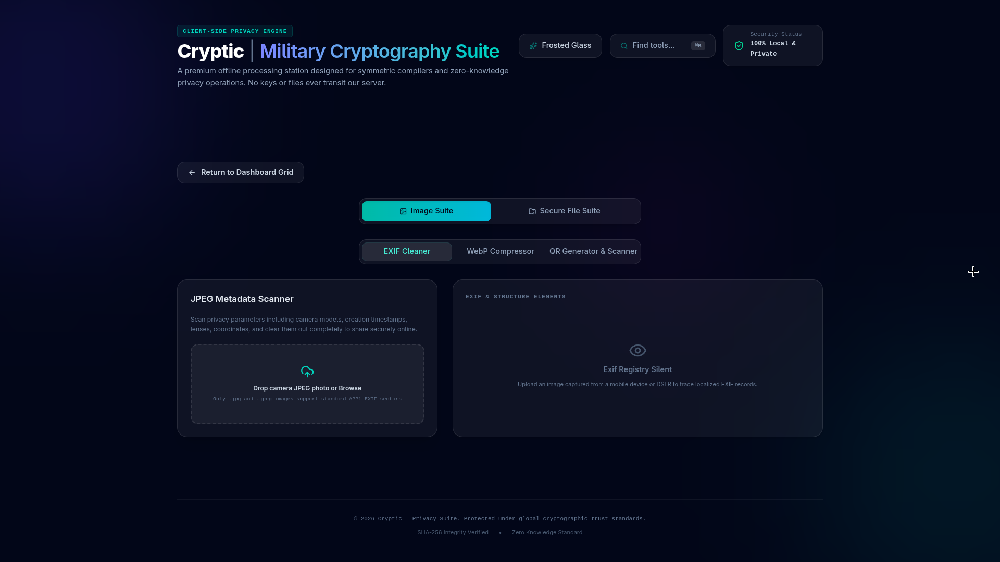
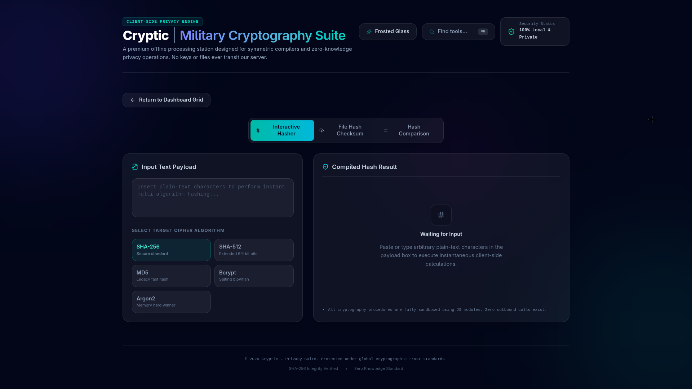
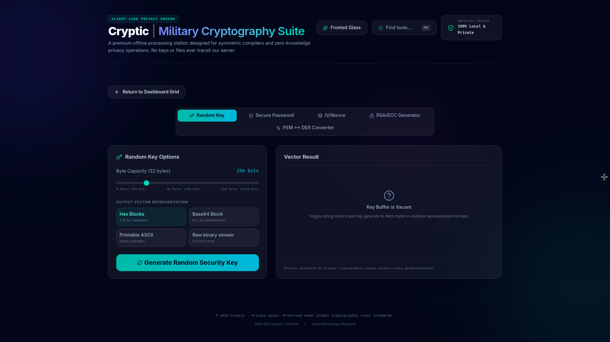
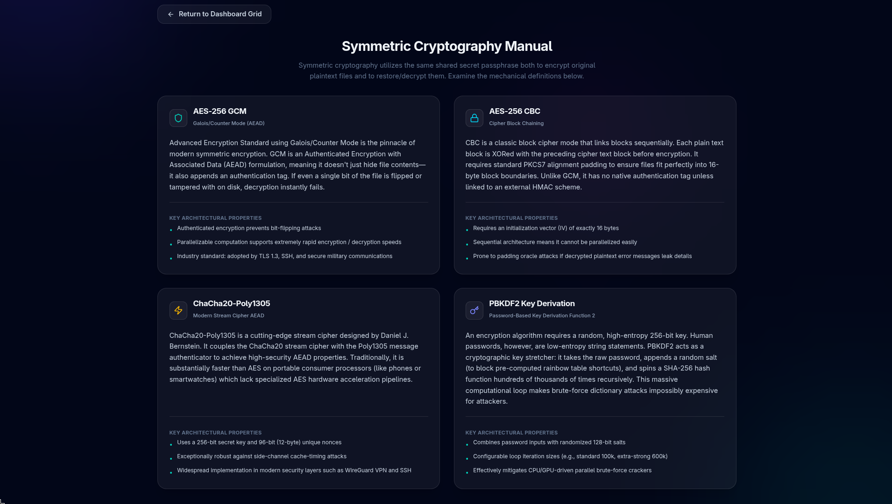

# 🛡️ Cryptic | Military Cryptography Suite

Cryptic is a privacy-focused browser cryptography platform built with React and Vite.

The suite provides advanced client-side encryption, forensic inspection, cryptographic utilities, developer tooling, and offline-capable secure workflows entirely inside the browser environment.

All encryption, hashing, file analysis, encoding, and transformation operations execute locally on the user's device without transmitting plaintext files, passwords, credentials, or cryptographic keys to external servers.

Cryptic is designed around:

- locality
- portability
- offline-capable execution
- browser-native cryptography
- operational privacy

---

# Core Security Architecture

## Browser-Local Processing

Cryptic performs operations directly inside the browser runtime using client-side JavaScript and browser cryptographic APIs.

The server only distributes static frontend assets (HTML/CSS/JS bundles). After loading:

- encryption occurs locally
- decryption occurs locally
- hashes are computed locally
- file inspection occurs locally
- metadata extraction occurs locally
- vault operations remain local

Sensitive payloads are not uploaded for cryptographic processing.

---

## Offline-Capable Operation

After initial loading, Cryptic can continue functioning in isolated environments using:

- Docker containers
- local development builds
- LAN-hosted execution
- air-gapped deployments

This architecture reduces dependency on external infrastructure and improves operational privacy.

---

# Feature Overview

## 🔐 Symmetric Encryption & Vaults

### Image ZIP Packager

Compresses and encrypts multiple high-resolution images into AES-GCM protected ZIP archives.

### Symmetric File Encryptor

Encrypts text and markdown files locally using:

- AES-256-GCM
- AES-256-CBC
- ChaCha20-Poly1305

Supports PBKDF2-derived passphrase stretching.

### Credentials Notes Vault

Stores sensitive notes, API tokens, and credentials inside encrypted local browser containers using authenticated GCM storage.

---

## 🔍 Integrity & Forensic Suite

### Image & File Forensic Suite

Provides:

- EXIF metadata inspection
- metadata stripping
- QR generation/scanning
- signature hash verification
- secure multi-pass file shredding

---

## ⚙️ Cryptographic Core & Utilities

### Cryptographic Hash Engine

Generates:

- SHA-256 hashes
- SHA-512 hashes
- MD5 signatures
- Bcrypt password hashes
- Argon2 password hashes

### Asymmetric Key Utilities

Creates browser-generated:

- RSA keypairs
- ECC keypairs

Supports standardized PEM export formats:

- PKCS#1
- PKCS#8

### Representation Compilers

Encodes and decodes:

- Base64
- Hexadecimal
- Binary
- URL encoding
- HTML entities
- JWT payload parsing

### Developer Utilities

Includes:

- JSON/XML formatting
- YAML ↔ JSON conversion
- RegExp testing
- schema validation
- side-by-side diff matching
- Unix epoch calculations

---

## 🧪 Security Labs & Academic Resources

### Security Tester & ZK Privacy Labs

Provides:

- password strength analysis
- compromised credential checks
- SSL certificate inspection
- HTTP security header analysis
- self-destructing secure paste generation

### Symmetric Cryptography Manual

Offline educational reference covering:

- block cipher modes
- padding standards
- GCM internals
- key derivation
- secure cryptographic practices

---

## 🌐 Global System Features

### Global Drag & Drop Detector

Automatically analyzes dropped files to:

- identify extensions
- inspect sizes
- classify payloads
- suggest compatible cryptographic tools

### Searchable Command Palette (Ctrl + K)

Keyboard-driven navigation layer for:

- instant tool switching
- command execution
- settings toggles
- workflow acceleration

### Dual Styling Themes

Includes:

- Frosted Glass immersive theme
- Midnight Noir low-light theme

---

# Tech Stack

- React
- Vite
- Tailwind CSS
- Docker
- NGINX

---

# Usage Methods

Cryptic supports:

1. Vercel Hosted Deployment
2. Local Development Runtime
3. Docker Runtime Execution

---

# Method 1 — Use Online via Vercel

Access the live deployed application directly in your browser without installing anything locally.

## Open Application

https://cryptic-roan.vercel.app/

---

# Method 2 — Local Development

## Clone Repository

```bash
git clone https://github.com/Raees091/cryptic.git
cd cryptic
```

---

## Install Dependencies

```bash
npm install
```

---

## Start Development Server

```bash
npm run dev
```

Open:

```txt
http://localhost:3000
```

---

## Build Production Assets

```bash
npm run build
```

Compiled assets are generated inside:

```txt
dist/
```

---

# Method 3 — Docker Runtime

Docker provides isolated, portable execution without manually installing dependencies.

## Pull Image

```bash
docker pull raees091/cryptic:latest
```

---

## Run Container

```bash
docker run -p 8080:80 raees091/cryptic:latest
```

---

## Open Application

```txt
http://localhost:8080
```

---

## Stop Container

```bash
docker stop <container_id>
```

---

## Remove Container

```bash
docker rm <container_id>
```

---

# LAN Access

Expose the development server to other devices on the same network:

```bash
npm run dev -- --host
```

Then access:

```txt
http://<local-ip>:3000
```

from another device connected to the same LAN.

---

# Screenshots

- Main dashboard
    
- Image & File Forensics
    
- Cryptographic Hash Engine
    
- Asymmetric Key Utilities
    
- Symmetric Cryptography Manual
    

---

# Future Improvements

- Progressive Web App (PWA) support
- WebAssembly cryptographic acceleration
- Hardware security key integration
- Secure offline caching
- Encrypted workspace synchronization
- Bundle optimization & lazy loading

---

# License

MIT License
